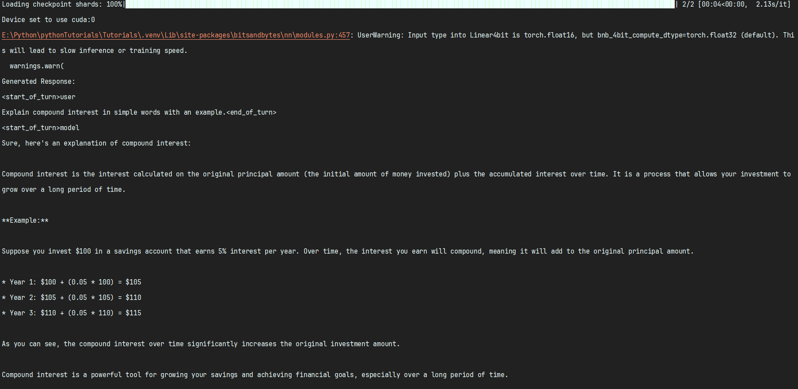
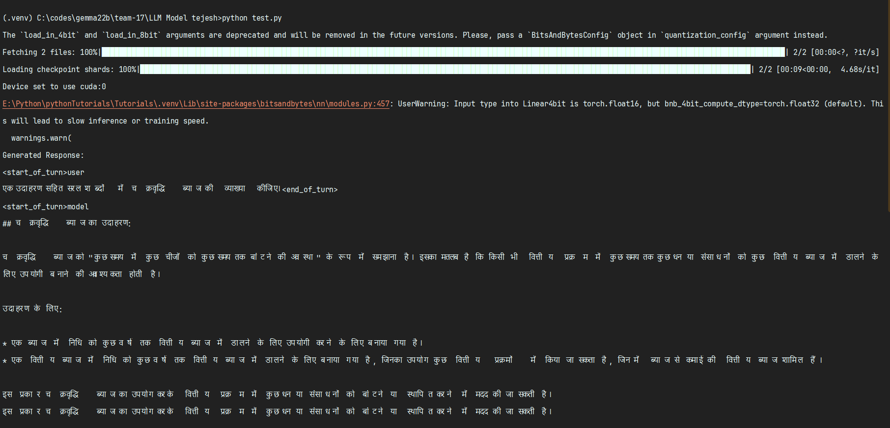

# 📚 RiseUp LLM – Student Doubt Resolution with Fine-Tuned Gemma-2B-IT

> **Empowering youth through AI:**
> A lightweight Large Language Model (LLM) fine-tuned to answer students' doubts on financial literacy and vocational training, running even on modest GPUs (like RTX 1650, 12GB RAM).

---


---

## 🌟 Project Overview

Many young learners lack personalized guidance when exploring financial literacy or vocational skills.
This project fine-tunes **Gemma-2B-IT** to:

* ✅ Answer student doubts in Hindi, English & local languages
* ✅ Recommend relevant courses
* ✅ Run efficiently on consumer-grade GPUs using **QLoRA**

---

## ⚙️ Tech Stack & Tools

| Purpose                    | Tool/Framework           |
| -------------------------- | ------------------------ |
| LLM & Fine-Tuning          | 🤗 Transformers          |
| Parameter-efficient tuning | PEFT (LoRA)              |
| Quantization               | bitsandbytes (4-bit)     |
| Dataset handling           | 🤗 datasets              |
| Training orchestration     | Trainer API              |
| Hosting & Sharing          | Hugging Face Hub         |
| Language                   | Python 3.10+ (venv used) |

---

## 📦 Folder Structure

```
.
├── train_data.json             # Custom instruction-response dataset
├── finetune.py                 # Fine-tune with QLoRA + LoRA
├── upload.py                   # Upload adapters to Hugging Face
├── testGemma.py                # Quick test with base model
├── runn.py                     # Inference using fine-tuned adapter
├── requirements.txt            # Python dependencies
└── README.md
```

---

## 🏗️ How It Works

✅ **Step 1: Prepare dataset**
Add student Q\&A pairs in `train_data.json`.

✅ **Step 2: Fine-tune**
Run `finetune.py`:

* Loads Gemma-2B-IT with 4-bit quantization (via bitsandbytes)
* Adds LoRA adapters (PEFT)
* Fits data on GPU with gradient accumulation & memory-efficient config

✅ **Step 3: Upload**
Run `upload.py` to upload trained adapters to [Hugging Face](https://huggingface.co/tejeshkumarg/ubs).

✅ **Step 4: Inference**
Use `runn.py`:

* Loads base Gemma-2B-IT + your adapter
* Generates answers to new questions with special Gemma chat format

---

## 🧪 Example Prompt

```
<start_of_turn>user
Explain compound interest with an example.<end_of_turn>
<start_of_turn>model
```

---

## 🚀 Hosting & Demo

* Fine-tuned adapters hosted: [tejeshkumarg/ubs](https://huggingface.co/tejeshkumarg/ubs)
* Can integrate with chatbot frontend (web / mobile).

---

## 📌 Why QLoRA + PEFT?

* Trains only lightweight adapter layers → faster & cheaper
* Needs \~8–10GB VRAM instead of full 24GB+
* Base model remains unchanged for stability

---

## 🧰 Setup & Installation

```bash
# Create virtual env
python -m venv gemma

# Activate (Windows)
.\gemma\Scripts\activate

# Install dependencies
pip install -r requirements.txt
```

> ⚠ On CPU-only: remove bitsandbytes & quantization logic.

---

## 🤝 Contributing

Pull requests welcome!

* Fork → clone → create branch → commit → push → open PR
* Please follow clean code and add meaningful commit messages.

---

## ✏️ Author

**Tejesh Kumar**
*Designed, fine-tuned, optimized and hosted the LLM.*

---

## 📄 License

Free for educational & non-commercial use.
MIT License.

---

## 📦 requirements.txt

```txt
torch
transformers
peft
datasets
bitsandbytes
huggingface_hub
```






